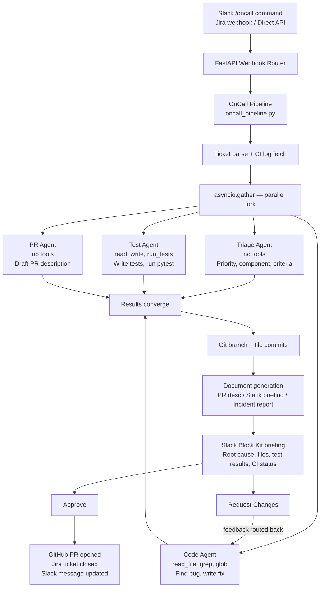

<p align="center">
  
  
  
  
</p>

<h1 align="center">Anton</h1>

<p align="center">
  <strong>Autonomous on-call engineer that triages, fixes, tests, and ships bug patches — without waking a human.</strong>
</p>

<p align="center">
  Bug lands. Four AI agents fix it in parallel. You approve in one tap. PR is open.
</p>

---

<br/>

## The Problem

A production bug comes in at 2am. An on-call engineer wakes up, spends 20 minutes reading logs, 30 minutes finding the root cause, 20 minutes writing a fix, 15 minutes writing tests, 10 minutes drafting a PR. That's 95 minutes of mechanical work that a machine should be doing.

Anton does that work autonomously. The engineer wakes up to a Slack message, reads a one-paragraph summary, taps **Approve**, and goes back to sleep.

<br/>

## How It Works



<br/>

## Key Features

| Feature | Detail |
|---|---|
| **Parallel multi-agent execution** | 4 specialized agents run concurrently via `asyncio.gather()`. Pipeline time equals the slowest agent, not the sum. |
| **Cross-validation by design** | Code Agent and Test Agent derive fixes independently from the ticket. If both converge on the same conclusion, confidence is high. |
| **Human-in-the-loop** | Slack Block Kit interactive messages with Approve / Request Changes buttons. Not a chatbot, not a dashboard. |
| **Feedback loops** | Rejected? Human feedback routes back to the Code Agent for a revision cycle, then re-briefs. |
| **Safety layer** | 6 approval policies from `YOLO` to `NEVER`. Dangerous command regex detection, path-scoped execution, safe command whitelist. |
| **MCP extensible** | Full Model Context Protocol client. Add database, cloud, or custom tool servers without touching core code. |
| **Context compression** | LLM-powered conversation summarization when token budgets approach limits. Agents can run indefinitely within context windows. |
| **Loop detection** | Tracks tool call signatures, detects exact repeats and cycles, breaks loops gracefully before turn limits hit. |
| **Triple document generation** | Every run produces a GitHub PR description, Slack briefing, and persistent incident report for post-mortems. |
| **Zero-credential demo** | Mock clients for GitHub, Jira, and CI. Full pipeline works end-to-end without any external API keys. |

<br/>

## The Four Agents

Anton's pipeline is not a chain. It is a **parallel fork**. All four agents launch simultaneously with isolated contexts, separate tool access, and independent timeouts.

### Triage Agent

Pure reasoning. No tools. No file access.

Reads the ticket text and outputs structured JSON: priority classification (P1-P4), affected component, acceptance criteria, edge cases. This output is injected into the Code and Test agent goals, giving them context without file I/O overhead.

```json
{
  "priority": "P1 Critical",
  "component": "todo-service",
  "affected_files_hint": ["todos/service.py"],
  "acceptance_criteria": [
    "complete() always sets completed=True, never toggles",
    "Calling complete() twice is idempotent"
  ],
  "edge_cases": ["complete already-completed todo", "complete non-existent todo"]
}
```

### Code Agent

Find the bug. Write the fix. Nothing more.

Has read access to the full repository. Searches files, reads modules, identifies the exact broken line(s), and outputs the corrected file content in a structured format the orchestrator can parse and commit. Strictly instructed to fix what is broken and not refactor what is not.

Tools: `read_file`, `grep`, `glob`, `list_dir` | Max turns: 15 | Timeout: 180s

### Test Agent

Write regression tests. Run the suite. Prove it works.

Reads existing tests to match style and fixtures, generates new cases covering the bug scenario and all edge cases from triage, writes them into the test file, runs `pytest`, reports results. If tests fail, it attempts one self-correction cycle before reporting.

Tools: `read_file`, `write_file`, `run_tests`, `grep`, `glob` | Max turns: 20 | Timeout: 300s

The Test Agent does **not** see the Code Agent's output. It derives the fix independently from the ticket description. Agreement between both agents acts as cross-validation.

### PR Agent

Write the pull request description a senior engineer would write.

Pure text synthesis. No tools, no file access. Given the ticket metadata, it drafts a complete PR body with Problem, Root Cause, Solution, Files Changed, Tests, and How to Verify sections. Not a template. A contextual narrative.

<br/>

## Architecture

### Project Structure

```
anton/
|
|-- main.py                          # FastAPI server, webhook endpoints, run management
|
|-- workflow/
|   +-- oncall_pipeline.py           # Core orchestrator, parallel agent execution, HITL
|
|-- agents/
|   +-- definitions.py               # SubagentDefinition for all 4 agents
|
|-- agent/                           # Custom agentic loop engine
|   |-- orchestrator.py              # Streaming agent loop, LLM <-> tool dispatch
|   |-- session_manager.py           # Session lifecycle, MCP init, memory loading
|   |-- session_persistence.py       # Save/resume sessions to disk
|   +-- event_types.py               # Typed event system
|
|-- tools/
|   |-- specialized_agents.py        # SubagentTool, spawns isolated child agents
|   |-- tool_registry.py             # Dynamic registration + approval routing
|   |-- plugin_loader.py             # External plugin discovery
|   |-- mcp/                         # Model Context Protocol client
|   |   |-- mcp_client.py            # FastMCP client wrapper
|   |   |-- mcp_connection_manager.py# Server lifecycle management
|   |   +-- mcp_tool_adapter.py      # MCP -> Tool interface adapter
|   +-- builtin/                     # 20+ built-in tools
|       |-- file_reader.py           |-- file_writer.py
|       |-- file_editor.py           |-- shell_executor.py
|       |-- test_executor.py         |-- test_generator.py
|       |-- text_search.py           |-- pattern_matcher.py
|       |-- directory_listing.py     |-- github_tools.py
|       |-- jira_tool.py             |-- slack_tool.py
|       |-- web_fetcher.py           |-- web_searcher.py
|       |-- persistent_memory.py     +-- task_manager.py
|
|-- integrations/
|   |-- slack_bot.py                 # Block Kit builder + interactive callbacks
|   |-- github_client.py             # Branch, commit, PR via PyGithub
|   |-- jira_client.py               # REST v3, ticket ingestion + transitions
|   +-- cicd_monitor.py              # GitHub Actions log fetching
|
|-- documents/
|   +-- doc_generator.py             # PR desc, Slack briefing, incident report
|
|-- context/
|   |-- conversation_manager.py      # Message history + token budget
|   |-- context_compressor.py        # LLM-powered conversation summarization
|   +-- infinite_loop_detector.py    # Action pattern cycle detection
|
|-- safety/
|   +-- permission_manager.py        # 6 approval policies + command classification
|
|-- config/
|   |-- configuration.py             # Pydantic typed config
|   +-- config_loader.py             # TOML config parser
|
|-- hooks/
|   +-- lifecycle_hooks.py           # before_agent, after_tool, on_error
|
|-- client/
|   |-- api_client.py                # Streaming LLM client with retries
|   +-- api_response_types.py        # Typed stream event models
|
|-- prompts/
|   +-- system_prompts.py            # Dynamic system prompt generation
|
|-- ui/
|   +-- terminal_interface.py        # Rich terminal UI (CLI mode)
|
|-- demo/
|   |-- trigger.py                   # Fire a demo webhook without Slack
|   +-- sample_repo/                 # Buggy todo service (intentional bug)
|
+-- .oncall_runs/                    # Persistent incident report archive
```

### Engine Internals

Custom agentic loop. Not LangChain, not AutoGen, not CrewAI. Every layer is purpose-built.

| Component | What It Does |
|---|---|
| **Orchestrator** | Stream-first LLM interaction. Tokens processed as they arrive, tool calls dispatched eagerly. Does not wait for full response before acting. |
| **SubagentTool** | Spawns completely isolated child agents. Separate conversation histories, tool sets, and timeouts. Parent sees only the final response string. Zero context bleed. |
| **ContextCompressor** | Uses the LLM itself to summarize earlier turns when token budget approaches limit. Preserves essential facts, discards verbose intermediate steps. |
| **LoopDetector** | Tracks action signatures across history. Detects exact repeats (same call 3x) and cycles (repeating sequences of 2-3 calls). Breaks loops gracefully. |
| **PermissionManager** | Spectrum of approval policies: `YOLO > AUTO > AUTO_EDIT > ON_REQUEST > NEVER > ON_FAILURE`. Regex-based dangerous command detection + safe command whitelist. |
| **MCP Client** | Full FastMCP client with stdio + HTTP/SSE transports. MCP server tools auto-register in the tool registry. Extend Anton without touching core code. |
| **Lifecycle Hooks** | `before_agent` / `after_tool` / `on_error` events. Configure external scripts for monitoring, metrics, or custom workflows. |

### Parallel Execution Model

```python
triage_raw, code_raw, test_raw, pr_raw = await asyncio.gather(
    _run_subagent(TRIAGE_AGENT, triage_goal, repo_cwd),
    _run_subagent(CODE_AGENT,   code_goal,   repo_cwd),
    _run_subagent(TEST_AGENT,   test_goal,   repo_cwd),
    _run_subagent(PR_AGENT,     pr_goal,     repo_cwd),
)
```

All four agents make LLM API calls, tool invocations, and file reads concurrently. The Code Agent's execution typically dominates, so the other three finish first and wait. Net result: 4 agents complete in the time of 1.

<br/>

## Integrations

### Slack

| | |
|---|---|
| **Trigger** | `/oncall <bug description>` slash command |
| **Output** | Block Kit interactive message, not plain text |
| **Actions** | Approve & Open PR, Request Changes (with feedback routing) |
| **Updates** | Message edited in-place after decision, no duplicate messages |
| **Scopes** | `chat:write`, `chat:write.public`, `commands` |

### GitHub

| | |
|---|---|
| **Branches** | `fix/{ticket_key}-{run_id}` naming convention |
| **Commits** | Each changed file committed individually with descriptive messages |
| **PRs** | Full description body, `bug` + `anton` labels, linked to ticket |
| **Idempotent** | If a PR already exists for the branch, returns the existing URL |

### Jira

| | |
|---|---|
| **Ingestion** | Reads ticket via REST API v3: summary, description, priority, components |
| **Transitions** | In Progress on pipeline start, Done on PR approval |
| **Comments** | Posts PR URL as a comment on the ticket |
| **Fallback** | No credentials configured: rich demo ticket `BUG-42` used automatically |

### CI/CD

| | |
|---|---|
| **Log ingestion** | Reads GitHub Actions failure logs for Code Agent context |
| **Status** | Pass/fail shown in Slack briefing |
| **Format** | Parses standard pytest output from CI logs |

<br/>

## Quick Start

### Prerequisites

- Python 3.9+
- An LLM API key ([OpenRouter](https://openrouter.ai) recommended, gives access to Claude, GPT-4o, Llama, and more)
- A Slack workspace where you can install apps
- A GitHub account with a target repository
- [ngrok](https://ngrok.com) or any tunnel for Slack callbacks

### 1. Install

```bash
git clone https://github.com/PranavPipariya/anton.git
cd anton
pip install -r requirements.txt
```

### 2. Configure

```bash
cp .env.example .env
```

```bash
# LLM provider (OpenRouter recommended)
API_KEY=sk-or-v1-...
BASE_URL=https://openrouter.ai/api/v1

# GitHub — repo Anton will open PRs against
GITHUB_TOKEN=ghp_...
GITHUB_REPO=yourname/your-repo

# Slack
SLACK_BOT_TOKEN=xoxb-...
SLACK_CHANNEL=anton

# Jira (optional — demo mode if not set)
JIRA_BASE_URL=https://your-org.atlassian.net
JIRA_EMAIL=you@company.com
JIRA_API_TOKEN=...
```

### 3. Create Slack App

1. Go to [api.slack.com/apps](https://api.slack.com/apps), Create New App, From scratch
2. Name it `Anton`, pick your workspace
3. OAuth & Permissions: add scopes `chat:write`, `chat:write.public`, `commands`
4. Install to Workspace, copy Bot Token, set as `SLACK_BOT_TOKEN`
5. Create `#anton` channel, `/invite @Anton`

### 4. Expose with ngrok

```bash
ngrok http 8000
```

In your Slack app settings:

- **Slash Commands**: `/oncall` pointing to `https://<ngrok-url>/webhook/slack/command`
- **Interactivity**: Request URL set to `https://<ngrok-url>/webhook/slack/actions`

### 5. Launch

```bash
uvicorn main:app --port 8000
```

```
  Anton -- Ready
  Repo CWD : ./demo/sample_repo
  Jira     : mock
  Slack    : live
  GitHub   : live
```

### 6. Run the demo

In Slack:

```
/oncall todo complete bug — calling complete() twice un-completes the todo
```

Anton will:
1. Acknowledge immediately in the channel
2. Launch four agents in parallel
3. Post a structured briefing with an **Approve** button
4. On tap: open the PR on GitHub and post the link back

Or trigger programmatically:

```bash
python demo/trigger.py
```

<br/>

## API Reference

| Method | Endpoint | Description |
|--------|----------|-------------|
| `POST` | `/webhook/jira` | Jira issue webhook trigger |
| `POST` | `/webhook/slack/command` | Slack `/oncall` slash command |
| `POST` | `/webhook/slack/actions` | Slack interactive button callbacks |
| `GET` | `/health` | Service status + active run count |
| `GET` | `/runs` | List all active pipeline runs |
| `GET` | `/runs/{run_id}` | Detailed status of a specific run |
| `POST` | `/runs/{run_id}/approve` | Programmatic approval (testing/CI) |
| `POST` | `/runs/latest/approve` | Approve the most recent run |

<br/>

## Demo Repository

`demo/sample_repo/` contains a minimal FastAPI todo service with a real, intentional bug:

```python
# todos/service.py
def complete(self, todo_id: int) -> Optional[Todo]:
    todo = self.get(todo_id)
    if todo is None:
        return None
    todo.completed = not todo.completed  # BUG: toggles instead of sets
    return todo
```

First call: `False` becomes `True`. Works by accident. Second call: `True` becomes `False`. Silently un-completes the todo.

This is a real class of bug that exists in production codebases. Anton finds it, writes the one-line fix (`todo.completed = True`), and the Test Agent independently verifies with regression tests:

```python
def test_complete_is_idempotent(svc):
    todo = svc.create("Deploy to prod")
    svc.complete(todo.id)   # False -> True
    svc.complete(todo.id)   # True  -> True (after fix)
    assert svc.get(todo.id).completed is True
```

<br/>

## Environment Variables

| Variable | Required | Description |
|----------|:--------:|-------------|
| `API_KEY` | required | LLM provider API key |
| `BASE_URL` | required | LLM provider base URL (omit for direct OpenAI) |
| `GITHUB_TOKEN` | required | GitHub PAT with `repo` scope |
| `GITHUB_REPO` | required | Target repository, `owner/repo` format |
| `SLACK_BOT_TOKEN` | required | Slack bot token (`xoxb-...`) |
| `SLACK_CHANNEL` | required | Channel name (without `#`) |
| `JIRA_BASE_URL` | optional | Jira instance URL (demo mode if unset) |
| `JIRA_EMAIL` | optional | Jira account email |
| `JIRA_API_TOKEN` | optional | Jira API token |
| `REPO_CWD` | optional | Path to local repo clone (defaults to `demo/sample_repo`) |

<br/>

## Built With

| Technology | Role |
|---|---|
| **Python 3.9+** | Runtime |
| **FastAPI** | Webhook server + REST API |
| **asyncio** | Parallel agent orchestration |
| **OpenAI SDK** | LLM client (OpenRouter / OpenAI / any compatible API) |
| **Slack SDK** | Block Kit messages + interactive components |
| **PyGithub** | Branch, commit, PR operations |
| **Pydantic** | Typed configuration + data models |
| **tiktoken** | Token counting + context budget management |
| **Rich** | Terminal UI formatting |
| **httpx** | Async HTTP client for Jira + external APIs |
| **DuckDuckGo Search** | Web search tool for agents |
| **TOML** | Configuration file format |

<br/>

## Contributing

Anton is built on a custom agentic loop engine with clear separation between the orchestration layer, the tool system, and the integration layer. New capabilities generally fall into one of three buckets:

**New tools** — add a file to `tools/builtin/` implementing the `Tool` base class, register it in the tool registry. It will automatically become available to any agent whose `allowed_tools` list includes it.

**New integrations** — add a client to `integrations/` following the existing Jira/GitHub/Slack pattern. Mock fallbacks are expected so the demo remains self-contained.

**New MCP servers** — configure them in `config/` under `mcp_servers`. No core code changes required.

For larger changes — new agent definitions, changes to the orchestration pipeline, modifications to the agentic loop — open an issue first to discuss the design before sending a PR.

Pull requests should include tests where applicable. The demo repository in `demo/sample_repo/` is the primary integration test surface.

---

MIT License
